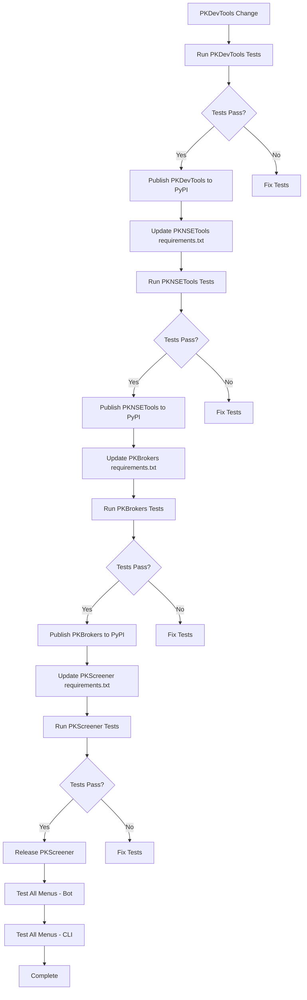

# PKScreener Ecosystem Release Process

## Overview

This document outlines the release process for the PKScreener ecosystem, which consists of four interdependent packages:

```
PKDevTools (base)
    ↓
PKNSETools ←── (depends on PKDevTools)
    ↓
PKBrokers ←──── (depends on PKDevTools + PKNSETools)
    ↓
PKScreener ←─── (depends on PKDevTools + PKNSETools + PKBrokers)
```

## Version Format

All packages use the following version format:

```
major.minor.YYYYMMDD.buildNumber
```

Example: `0.13.20251225.317`

- **major.minor**: Semantic version (e.g., `0.13`)
- **YYYYMMDD**: Date of build (e.g., `20251225` for December 25, 2025)
- **buildNumber**: GitHub Actions workflow run number

## Dependency Chain

| Package | Depends On | Location in requirements.txt |
|---------|------------|------------------------------|
| PKDevTools | None | Base package |
| PKNSETools | PKDevTools | `PKDevTools>=0.13.YYYYMMDD.xxx` |
| PKBrokers | PKDevTools, PKNSETools | Both versions listed |
| PKScreener | PKDevTools, PKNSETools, PKBrokers | All three versions listed |

## Release Process

### When PKDevTools Changes

When code changes are committed/pushed to PKDevTools:

1. **Trigger PKDevTools PyPI Publish**
   - Workflow: `w2-workflow-python-publish.yml`
   - Repository: `pkjmesra/PKDevTools`
   - New version: `0.13.YYYYMMDD.{run_number}`

2. **Update PKNSETools requirements.txt**
   ```
   PKDevTools>=0.13.YYYYMMDD.{new_version}
   ```
   - Trigger PKNSETools PyPI Publish

3. **Update PKBrokers requirements.txt**
   ```
   PKDevTools>=0.13.YYYYMMDD.{new_version}
   PKNSETools>=0.1.YYYYMMDD.{new_version}
   ```
   - Trigger PKBrokers PyPI Publish

4. **Update PKScreener requirements.txt**
   ```
   PKDevTools>=0.13.YYYYMMDD.{new_version}
   PKNSETools>=0.1.YYYYMMDD.{new_version}
   PKBrokers>=0.1.YYYYMMDD.{new_version}
   ```
   - Trigger PKScreener Release workflow

### When PKNSETools Changes

1. Trigger PKNSETools PyPI Publish
2. Update PKBrokers requirements.txt with new PKNSETools version
3. Trigger PKBrokers PyPI Publish
4. Update PKScreener requirements.txt with new versions
5. Trigger PKScreener Release workflow

### When PKBrokers Changes

1. Trigger PKBrokers PyPI Publish
2. Update PKScreener requirements.txt with new PKBrokers version
3. Trigger PKScreener Release workflow

### When PKScreener Changes

1. Trigger PKScreener Release workflow (builds binary and creates release)

## Unit Test Requirements

### All Repositories Must:

1. **Run tests on every commit/push**
   - Tests must pass before PyPI publish
   - Tests must pass before release

2. **Test Execution Points**
   - Pre-commit hooks (local)
   - GitHub Actions on push
   - GitHub Actions on pull request
   - Before PyPI publish workflow
   - Before release workflow

### Test Commands by Repository

```bash
# PKDevTools
cd pkdevtools
python3 -m pytest test/ -v

# PKNSETools
cd pknsetools/pknsetools
python3 -m pytest test/ -v

# PKBrokers
cd PKBrokers
python3 -m pytest test/ -v

# PKScreener
cd PKScreener-main
python3 -m pytest test/ -v
```

### Required Test Coverage

| Repository | Test File Location | Required Tests |
|------------|-------------------|----------------|
| PKDevTools | `test/` | PKDataProvider, PKScalableDataFetcher, utilities |
| PKNSETools | `test/` | NSE data fetching, stock data parsing |
| PKBrokers | `test/` | Kite integration, candle store, tick data |
| PKScreener | `test/` | All scanners, menus, bot handlers, CLI |

## Documentation Requirements

### When to Update Documentation

1. **Design Changes**
   - Architecture changes
   - New data flow patterns
   - API modifications

2. **User Experience Changes**
   - New menu options
   - Changed scan behaviors
   - New bot commands

3. **Developer Contribution Guide**
   - Setup instructions
   - Contribution workflow
   - Code standards

### Documentation Locations

| Repository | Documentation Files |
|------------|---------------------|
| PKDevTools | `docs/ARCHITECTURE.md`, `docs/API_REFERENCE.md` |
| PKNSETools | `docs/` |
| PKBrokers | `docs/ARCHITECTURE.md` |
| PKScreener | `docs/`, `README.md` |

### Publishing Documentation

- Documentation is auto-published via ReadTheDocs
- Config: `readthedocs.yaml` in each repository

## Menu Validation Requirements

### All PKScreener Menus Must Be Tested

#### Via pkscreenerbot (Telegram Bot)
1. X Scanners (45 options)
2. P Predefined Scanners (36 options)
3. M Monitor (Intraday)
4. D Downloads
5. B Backtests

#### Via Console CLI App
```bash
# Test X scanner
./pkscreenercli -a Y -e -o "X:12:0"

# Test predefined scanner
./pkscreenercli -a Y -e -o "X:12:9:2.5:>|X:0:31:>|X:0:23:>|X:0:27:"

# Test all 36 predefined scans
for i in {1..36}; do
  ./pkscreenercli -a Y -e -o "$(get_predefined_scan_option $i)"
done
```

### Test Files for Menu Validation

| Test File | Coverage |
|-----------|----------|
| `test/tick_data_freshness_test.py` | Data freshness validation |
| `test/bot_menu_integration_test.py` | All bot menu tests |
| `test/console_menu_integration_test.py` | All CLI menu tests |

## GitHub Actions Workflows

### PKDevTools
- `w2-workflow-python-publish.yml` - PyPI publish

### PKNSETools
- `w2-workflow-python-publish.yml` - PyPI publish

### PKBrokers
- `w2-workflow-python-publish.yml` - PyPI publish
- `w11-workflow-test-coverage.yml` - Test coverage
- `w0-workflow-ticks-update.yml` - Tick data updates

### PKScreener
- `w2-workflow-python-publish.yml` - PyPI publish
- `w1-workflow-build-all.yml` - Build all platforms
- `w3-workflow-bot.yml` - Telegram bot
- `w8-workflow-alert-scan_generic.yml` - Scan workflows
- `w9-workflow-release.yml` - Release workflow

## Automated Release Pipeline

### Ideal Flow (When Implemented)



## Manual Release Checklist

When making changes to any dependent library:

- [ ] 1. Make code changes in the library
- [ ] 2. Run unit tests locally
- [ ] 3. Commit and push to repository
- [ ] 4. Wait for CI tests to pass
- [ ] 5. Trigger PyPI publish workflow with version `x.y.z` (auto-generates)
- [ ] 6. Wait for PyPI publish to complete
- [ ] 7. Update dependent libraries' requirements.txt
- [ ] 8. Repeat steps 2-6 for each dependent library
- [ ] 9. Test all PKScreener menus via bot
- [ ] 10. Test all PKScreener menus via CLI
- [ ] 11. Update documentation if needed
- [ ] 12. Create release with release notes

## Data Freshness Validation

All scans must use fresh tick data from PKBrokers during trading hours:

1. **Real-time data (Priority 1)**: From ZerodhaWebSocket → InMemoryCandleStore
2. **Local pickle (Priority 2)**: Cached data from previous sessions
3. **Remote pickle (Priority 3)**: GitHub-hosted pickle files

### Validation Tests

```python
# Test that real-time data takes priority
def test_realtime_data_takes_priority_over_pickle():
    # Mock candle store with fresh data
    # Verify real-time provider is used
    pass

# Test stale data detection
def test_stale_pickle_rejected_when_realtime_available():
    # During trading hours
    # Verify stale pickle is not used
    pass
```

## Troubleshooting

### Common Issues

1. **Version Mismatch**
   - Ensure all requirements.txt files have the latest versions
   - Check PyPI for the latest published versions

2. **Test Failures**
   - Check if dependent package tests are affected
   - Run tests in isolation to identify the issue

3. **PyPI Publish Failures**
   - Check twine upload logs
   - Verify credentials are correct
   - Ensure version doesn't already exist on PyPI

4. **Bot Not Responding**
   - Check `w3-workflow-bot.yml` workflow status
   - Verify environment variables are set correctly

## Contact

For issues with the release process, contact the maintainer at pkjmesra@gmail.com.
